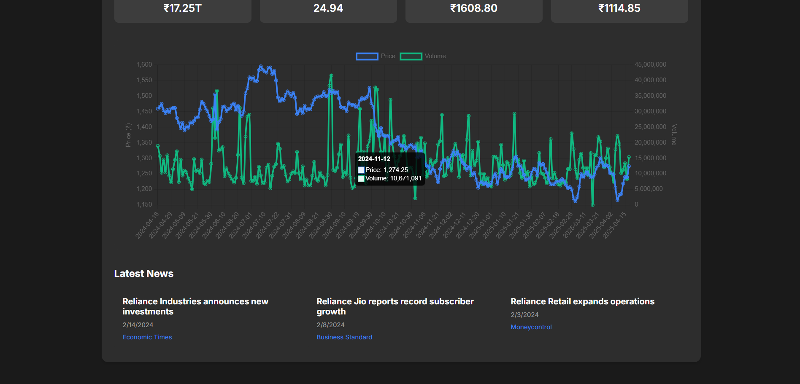

# 📈 Indian Stock Market Analysis Dashboard

A real-time stock market analysis dashboard that provides comprehensive insights into Indian stocks, including price trends, technical indicators, and market news.



## ✨ Features

- 🔍 Real-time stock search with 50+ major Indian companies
- 📊 Interactive price charts with volume analysis
- 📈 Technical analysis with buy/sell recommendations
- 📰 Latest news and updates for each stock
- 💹 Key financial metrics (Market Cap, P/E Ratio, 52-week High/Low)
- 🎨 Modern and responsive UI with dark mode

## 🛠️ Tech Stack

- **Backend:**
  - Python Flask
  - yfinance for stock data
  - scikit-learn for ML predictions
  - pandas for data analysis
  - numpy for calculations

- **Frontend:**
  - HTML5 & CSS3
  - Chart.js for interactive charts
  - Vanilla JavaScript
  - Animate.css for smooth animations

## 🚀 Getting Started

### Prerequisites

- Python 3.8 or higher
- pip (Python package manager)

### Installation

1. Clone the repository:
```bash
git clone https://github.com/yourusername/Indian-Stock-Analysis.git
cd Indian-Stock-Analysis
```

2. Create and activate a virtual environment:
```bash
python -m venv venv
source venv/bin/activate  # On Windows: .\venv\Scripts\activate
```

3. Install dependencies:
```bash
cd backend
pip install -r requirements.txt
```

4. Run the application:
```bash
python app.py
```

5. Open your browser and navigate to:
```
http://localhost:5000
```

## 📊 Stock Analysis Features

### 1. Stock Search
- Search across 50+ major Indian companies
- Real-time search suggestions
- Company name and symbol search

### 2. Price Analysis
- Interactive price charts
- Volume analysis
- 52-week high/low indicators
- Moving averages

### 3. Technical Indicators
- Buy/Sell recommendations using ML
- Market sentiment analysis
- Volume trend analysis

### 4. Financial Metrics
- Market Capitalization
- P/E Ratio
- 52-week High/Low
- Current Price

### 5. News Integration
- Latest company news
- Market updates
- Financial announcements

## 🎯 Supported Companies

The dashboard supports analysis of major Indian companies including:

- Banking: HDFC Bank, ICICI Bank, SBI, Axis Bank
- IT: TCS, Infosys, Wipro, HCL Tech
- Automobile: Tata Motors, Maruti Suzuki, Mahindra & Mahindra
- FMCG: HUL, ITC, Nestle, Britannia
- Pharma: Sun Pharma, Cipla, Dr. Reddy's
- And many more...

## 🤝 Contributing

Contributions are welcome! Please feel free to submit a Pull Request.

1. Fork the repository
2. Create your feature branch (`git checkout -b feature/AmazingFeature`)
3. Commit your changes (`git commit -m 'Add some AmazingFeature'`)
4. Push to the branch (`git push origin feature/AmazingFeature`)
5. Open a Pull Request

## 📝 License

This project is licensed under the MIT License - see the [LICENSE](LICENSE) file for details.

## 🙏 Acknowledgments

- [yfinance](https://pypi.org/project/yfinance/) for stock data
- [Chart.js](https://www.chartjs.org/) for interactive charts
- [Animate.css](https://animate.style/) for animations

## 📞 Contact

Your Name - saurabh singh - saurabhx2004@gmail.com

Project Link: [https://github.com/100rabx23/Indian-Stock-Analysis](https://github.com/yourusername/Indian-Stock-Analysis)

---

Made with ❤️ by 100RAB
